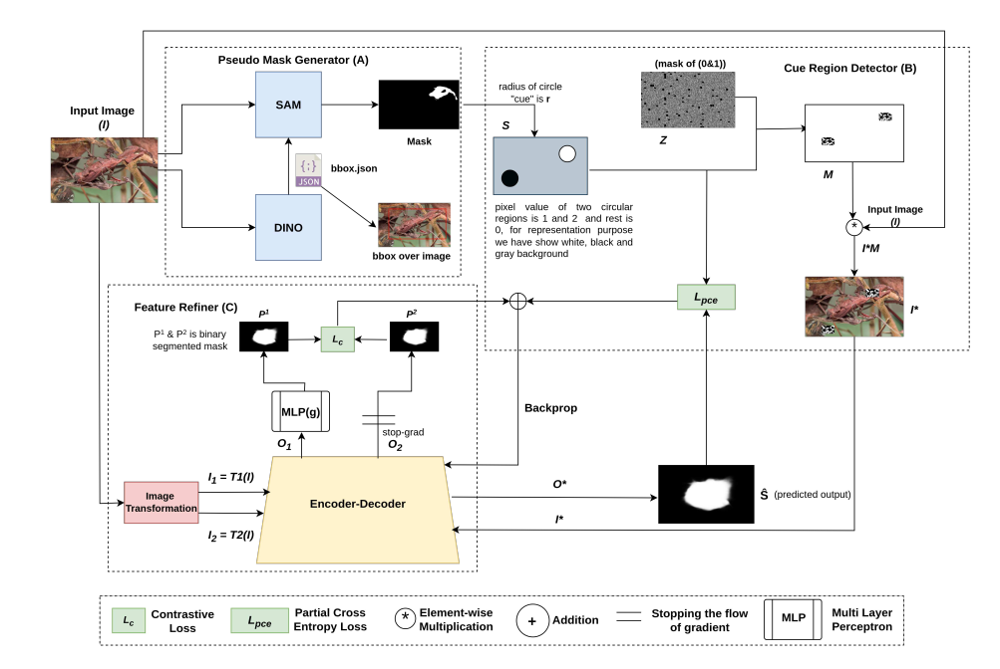
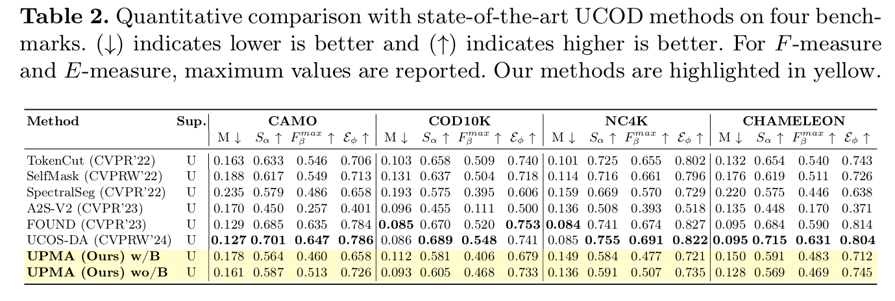

# [CVIP 25] UPMA: Unsupervised Pseudo Mask Attention for Camouflaged Object Detection using Foundation Models and Cue-Guided Refinement

# Our Work
[UPMA]()
# Download UPMA Benchmarks Dataset.
- COD10K: [google](https://dengpingfan.github.io/pages/COD.html) 
- CAMO: [google](https://sites.google.com/view/ltnghia/research/camo) 
- NC4K: [google] (https://github.com/JingZhang617/COD-Rank-Localize-and-Segment)
- CHAMELEON: [google] (https://drive.google.com/drive/folders/1LN4sP2DRtWcWHcgDcaZcWBVZfoJKccJU?usp=drive_link) 

# Generate Pseudo labels.
- We divided the dataset in to train and test. We took 3040 images from COD10K and 1000 images from CAMO in to the training set.
- We generated pseudo labels out these images using Fondation models shown in architecture.
- We have provided code to generate pseudo labels and store the best mask.

# Cue Region extraction
- Insert the proper file name and run `python Cue_gen.py` 

# Training
- Run `python train.py` 

# Test and Evaluate
- Change your path and filename accordingly
- Run python test.py
- results.txt will be stroed in PySODEvalToolkit

# Experimental Results

# Acknowledgement
[SAM- Segment-Anything](https://github.com/facebookresearch/segment-anything)
[PCOD](https://arxiv.org/abs/2408.10777)

