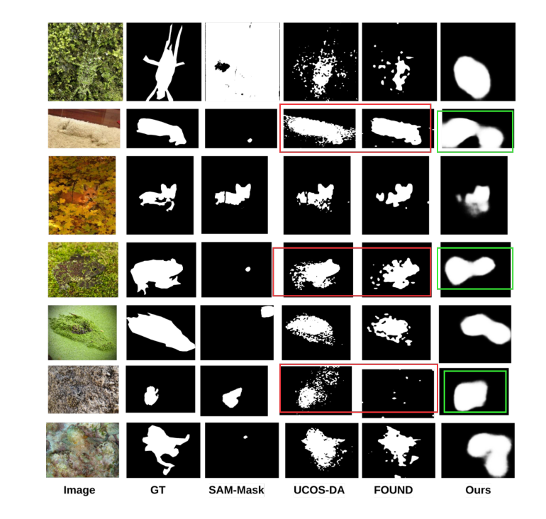

# [CVIP 2025] UPMA: Unsupervised Pseudo Mask Attention for Camouflaged Object Detection using Foundation Models and Cue-Guided Refinement


---
## 📌 Overview
**UPMA** introduces an unsupervised approach for **Camouflaged Object Detection (COD)** that leverages **foundation models** to generate high-quality pseudo masks, followed by **cue-guided refinement**.  

This pipeline avoids the need for expensive manual and it is highly interpreteble than other UCOD methods.
---

## 📂 Datasets
We evaluated UPMA on four standard COD datasets:  

- **COD10K**: [Link](https://dengpingfan.github.io/pages/COD.html)  
- **CAMO**: [Link](https://sites.google.com/view/ltnghia/research/camo)  
- **NC4K**: [Link](https://github.com/JingZhang617/COD-Rank-Localize-and-Segment)  
- **CHAMELEON**: [Link](https://drive.google.com/drive/folders/1LN4sP2DRtWcWHcgDcaZcWBVZfoJKccJU?usp=drive_link)  

**Training Split:**  
- 3,040 images from **COD10K**  
- 1,000 images from **CAMO**

---

## ⚙️ How to Reproduce

Getting started:  
### 1. Generate Pseudo Masks -> 2. Generate Cue mask(S)  -> 3. Training
```bash
cd PseudoMaskGenerator/scripts
python generate_pseudo_mask.py
python Cue_gen.py
python train.py
python test.py
PySODEvalToolkit/results.txt
```

### Our Results
 


### Acknowledgement

@misc{kirillov2023segment,
      title={Segment Anything}, 
      author={Alexander Kirillov and Eric Mintun and Nikhila Ravi and Hanzi Mao and Chloe Rolland and Laura Gustafson and Tete Xiao and Spencer Whitehead and Alexander C. Berg and Wan-Yen Lo and Piotr Dollár and Ross Girshick},
      year={2023},
      eprint={2304.02643},
      archivePrefix={arXiv},
      primaryClass={cs.CV},
      url={https://arxiv.org/abs/2304.02643}, 
}


